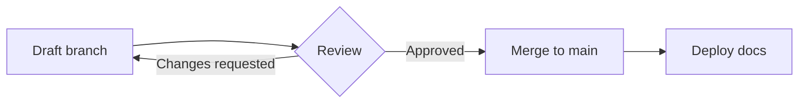

# Feature Showcase

Zensical is built on the same Markdown pipeline as Material for MkDocs, so
almost everything below is standard [Python-Markdown](https://python-markdown.github.io/)
plus the [PyMdown Extensions](https://facelessuser.github.io/pymdown-extensions/)
that ship with Zensical, all enabled in this project's
[`zensical.toml`](https://zensical.org/docs/setup/extensions/).

Every example below shows **Source** (the raw Markdown, copy-pasteable as-is)
directly above **Result** (what it renders to on this page).

## Admonitions

> [Docs](https://zensical.org/docs/authoring/admonitions/)

**Source:**

```text
!!! note

    Use `note` for general information the reader should be aware of.

!!! tip

    Use `tip` to highlight a shortcut or best practice.

!!! warning

    Use `warning` for things that can bite the reader if ignored.

!!! danger "Don't do this"

    Use `danger` for destructive or irreversible actions.
```

**Result:**

!!! note

    Use `note` for general information the reader should be aware of.

!!! tip

    Use `tip` to highlight a shortcut or best practice.

!!! warning

    Use `warning` for things that can bite the reader if ignored.

!!! danger "Don't do this"

    Use `danger` for destructive or irreversible actions.

Collapsible variants — `???` starts collapsed, `???+` starts expanded:

**Source:**

```text
??? info "Click to expand"

    Collapsible admonitions are great for FAQs, changelogs, or anything long
    that would otherwise push more important content below the fold.

???+ example "Expanded by default"

    Use `???+` instead of `???` to start expanded instead of collapsed.
```

**Result:**

??? info "Click to expand"

    Collapsible admonitions are great for FAQs, changelogs, or anything long
    that would otherwise push more important content below the fold.

???+ example "Expanded by default"

    Use `???+` instead of `???` to start expanded instead of collapsed.

## Code blocks

> [Docs](https://zensical.org/docs/authoring/code-blocks/)

**Source:**

````text
```python title="poker_odds.py" hl_lines="2"
def pot_odds(pot: int, to_call: int) -> float:
    return to_call / (pot + to_call)  # (1)!

print(pot_odds(pot=100, to_call=25))
```

1. Annotations attach a note to a specific line — click the circled number
   to read it. Requires `content.code.annotate`.
````

**Result:**

```python title="poker_odds.py" hl_lines="2"
def pot_odds(pot: int, to_call: int) -> float:
    return to_call / (pot + to_call)  # (1)!

print(pot_odds(pot=100, to_call=25))
```

1. Annotations attach a note to a specific line — click the circled number
   to read it. Requires `content.code.annotate`.

Inline highlighting — **Source:** `` `#!python pot_odds(100, 25)` `` →
**Result:** `#!python pot_odds(100, 25)`

## Content tabs

> [Docs](https://zensical.org/docs/authoring/content-tabs/)

**Source:**

````text
=== "Python"

    ```python
    print("Hello from Python!")
    ```

=== "JavaScript"

    ```javascript
    console.log("Hello from JavaScript!");
    ```

=== "Shell"

    ```bash
    echo "Hello from the shell!"
    ```
````

**Result:**

=== "Python"

    ```python
    print("Hello from Python!")
    ```

=== "JavaScript"

    ```javascript
    console.log("Hello from JavaScript!");
    ```

=== "Shell"

    ```bash
    echo "Hello from the shell!"
    ```

With `content.tabs.link` enabled, selecting a language in one tab group
switches every matching tab group on the page.

## Diagrams

> [Docs](https://zensical.org/docs/authoring/diagrams/)

**Source:**

````text

````

**Result:**


Rendered with the bundled [Mermaid](https://mermaid.js.org/) support — no
extra JavaScript needed, it's part of the Zensical theme bundle.

## Formatting

> [Docs](https://zensical.org/docs/authoring/formatting/)

**Source:**

```markdown
- ==This is marked/highlighted== (`pymdownx.mark`)
- ^^This is inserted^^ (`pymdownx.caret`)
- ~~This is deleted~~ (`pymdownx.tilde`)
- H~2~O — subscript (`pymdownx.tilde`)
- A^T^A — superscript (`pymdownx.caret`)
- ++ctrl+alt+delete++ — keyboard keys (`pymdownx.keys`)
- Smart symbols: (c) (r) (tm) --> <-- <-> (`pymdownx.smartsymbols`)
- Auto-linked URL: https://zensical.org (`pymdownx.magiclink`, no `[]()` needed)
```

**Result:**

- ==This is marked/highlighted== (`pymdownx.mark`)
- ^^This is inserted^^ (`pymdownx.caret`)
- ~~This is deleted~~ (`pymdownx.tilde`)
- H~2~O — subscript (`pymdownx.tilde`)
- A^T^A — superscript (`pymdownx.caret`)
- ++ctrl+alt+delete++ — keyboard keys (`pymdownx.keys`)
- Smart symbols: (c) (r) (tm) --> <-- <-> (`pymdownx.smartsymbols`)
- Auto-linked URL: https://zensical.org (`pymdownx.magiclink`, no `[]()` needed)

## Lists

### Task lists

> [Docs](https://zensical.org/docs/authoring/lists/#using-task-lists)

**Source:**

```markdown
- [x] Migrate docs from MkDocs to Zensical
- [x] Enable the full Markdown extension set
- [x] Write a feature showcase page
- [ ] Bikeshed the color palette
```

**Result:**

- [x] Migrate docs from MkDocs to Zensical
- [x] Enable the full Markdown extension set
- [x] Write a feature showcase page
- [ ] Bikeshed the color palette

### Definition lists

> [Docs](https://python-markdown.github.io/extensions/definition_lists/)

**Source:**

```markdown
Pot odds
:   The ratio of the current pot size to the cost of a contemplated call.

Implied odds
:   Pot odds adjusted for the money you expect to win on future betting
    rounds if you hit your draw.
```

**Result:**

Pot odds
:   The ratio of the current pot size to the cost of a contemplated call.

Implied odds
:   Pot odds adjusted for the money you expect to win on future betting
    rounds if you hit your draw.

## Footnotes

> [Docs](https://zensical.org/docs/authoring/footnotes/)

**Source:**

```markdown
Here's a claim that needs a citation.[^1] Hover the marker to read it
without leaving the page.

[^1]: This is the footnote text, rendered at the bottom of the page and as
    a hover tooltip.
```

**Result:**

Here's a claim that needs a citation.[^1] Hover the marker to read it
without leaving the page.

[^1]: This is the footnote text, rendered at the bottom of the page and as
    a hover tooltip.

## Abbreviations

> [Docs](https://python-markdown.github.io/extensions/abbreviations/)

**Source:**

```markdown
The HTML and CSS for this site are generated by Zensical from Markdown.

*[HTML]: HyperText Markup Language
*[CSS]: Cascading Style Sheets
```

**Result:** hover over either abbreviation below to see it expanded.

The HTML and CSS for this site are generated by Zensical from Markdown.

*[HTML]: HyperText Markup Language
*[CSS]: Cascading Style Sheets

## Tooltips

> [Docs](https://zensical.org/docs/authoring/tooltips/)

**Source:**

```markdown
[Hover this link][tooltip-example] to see a custom tooltip.

  [tooltip-example]: https://zensical.org "I'm a tooltip, not just a title!"
```

**Result:**

[Hover this link][tooltip-example] to see a custom tooltip.

  [tooltip-example]: https://zensical.org "I'm a tooltip, not just a title!"

## Icons and emoji

> [Docs](https://zensical.org/docs/authoring/icons-emojis/)

**Source:**

```markdown
* :sparkles:
* :rocket:
* :spade_suit:
* :moneybag:
* :material-cards-playing-outline:
```

**Result:** icon sets (Material, Octicons, FontAwesome, Simple, Lucide) work
the same way as emoji shortcodes.

* :sparkles:
* :rocket:
* :spade_suit:
* :moneybag:
* :material-cards-playing-outline:

## Attribute lists & inline HTML

> [Docs](https://python-markdown.github.io/extensions/attr_list/)

**Source:**

````text
Attach classes, ids, or attributes to elements.
{: .example-callout }

<div class="example-callout" markdown>
`md_in_html` lets you mix raw HTML with Markdown **inside** the same block,
so things like tables or admonitions still render correctly inside a `<div>`.
</div>
````

**Result:**

Attach classes, ids, or attributes to elements.
{: .example-callout }

<div class="example-callout" markdown>
`md_in_html` lets you mix raw HTML with Markdown **inside** the same block,
so things like tables or admonitions still render correctly inside a `<div>`.
</div>

## Maths

> [Docs](https://zensical.org/docs/authoring/math/)

**Source:**

```text
Inline: \(E = mc^2\). Block:

$$
\cos x=\sum_{k=0}^{\infty}\frac{(-1)^k}{(2k)!}x^{2k}
$$
```

**Result:**

Inline: \(E = mc^2\). Block:

$$
\cos x=\sum_{k=0}^{\infty}\frac{(-1)^k}{(2k)!}x^{2k}
$$

!!! warning "Needs a script tag"

    `pymdownx.arithmatex` (enabled in `zensical.toml`) only produces the
    markup above — it does not ship a renderer. Add MathJax or KaTeX via
    `extra_javascript` if a page actually needs math to *display*; it's
    omitted here on purpose to keep this page's own load light.

## Tables

> [Docs](https://zensical.org/docs/authoring/formatting/#tables)

**Source:**

```markdown
| Extension | What it adds |
|---|---|
| `admonition` | `!!!` call-out boxes |
| `pymdownx.tabbed` | `===` content tabs |
```

**Result:**

| Extension | What it adds |
|---|---|
| `admonition` | `!!!` call-out boxes |
| `pymdownx.tabbed` | `===` content tabs |

### Everything enabled in this project

| Extension | Package | What it adds |
|---|---|---|
| `admonition` | core | `!!!` call-out boxes |
| `pymdownx.details` | pymdown-extensions | collapsible `???` boxes |
| `pymdownx.tabbed` | pymdown-extensions | `===` content tabs |
| `pymdownx.superfences` | pymdown-extensions | nested/mermaid code fences |
| `pymdownx.tasklist` | pymdown-extensions | `- [x]` checkboxes |
| `footnotes` | core | `[^1]` footnotes |
| `def_list` | core | term/definition lists |
| `abbr` | core | abbreviation tooltips |
| `attr_list` | core | classes/attributes on elements |
| `md_in_html` | core | Markdown parsed inside raw HTML blocks |
| `pymdownx.mark` / `caret` / `tilde` | pymdown-extensions | highlight / insert / delete, sub/superscript |
| `pymdownx.keys` | pymdown-extensions | rendered keyboard shortcuts |
| `pymdownx.magiclink` | pymdown-extensions | bare URLs become links |
| `pymdownx.smartsymbols` | pymdown-extensions | `(c)`, `(tm)`, `-->` become typographic symbols |
| `pymdownx.arithmatex` | pymdown-extensions | LaTeX math markup |
